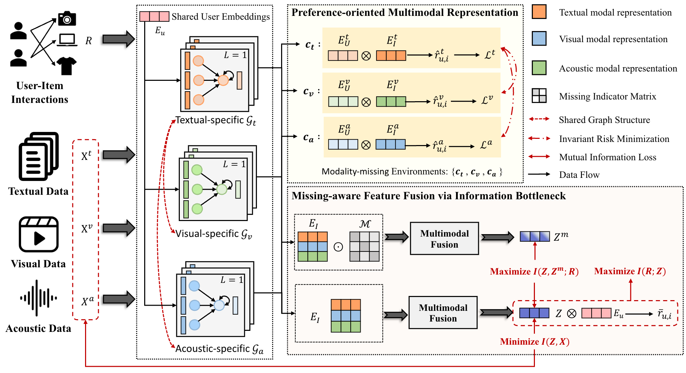

# MMRec: Missing-Modality Recommendation

**Current mainline:** there is one supported MMRec path:

`PROMRL completion -> raw decoder v2 -> original I3 linear MLP -> modality GCNs -> multi-source completed-feature item-item graph modal residual -> fusion -> BPR`

Use [docs/MAINLINE.md](docs/MAINLINE.md) as the source of truth
before launching experiments. Historical branches such as MLP imputation,
semantic bridge, score-level assemble fusion, and non-mainline CL objectives
are retired or ablation-only.

## Overview

MMRec is the current project name for this codebase. The current goal is to build a strong **missing-modality recommendation** system by combining:

- a modality-sensitive recommender backbone
- a PROMRL-based completion module
- a recommendation workflow that remains effective under `ff / fm / mf / mm` missing-modality protocols

The current mainline keeps the original I3 recommender backbone components:

- `original linear MLP`
- `GCN`
- `fusion`
- `BPR`

and connects them with a front-end completion pipeline and a leakage-safe
completed-feature post-GCN item-item graph residual:

`PROMRL completion -> raw decoder -> original I3 linear MLP -> modality GCNs -> multi-source completed item-item graph modal residual -> fusion -> BPR`

The stage-2 mainline uses `item_graph_kind=fused_completed` with positive CF,
image, and text graph weights as the multi-source item-item graph. The fused
graph is applied with `item_graph_modal_alpha=0.25` as a post-GCN, pre-fusion
item-item graph residual. Single-source item graphs are a side branch for
ablation, not the default path. The only retained recommendation-side CL is the
post-GCN true-missing InfoNCE objective controlled by `rec_neighbor_cl_weight`.
Score-level assembly/fusion with an auxiliary all-gate recommender is not part
of the mainline and should be treated as a retired experiment.

At the same time, the current project explicitly excludes the original I3 invariant-learning and information-bottleneck objectives from the mainline, so MMRec should be understood as the current missing-modality recommendation project name for this modified codebase rather than a direct rename of the original paper method.


## Updates
- Update (November 24, 2025): Fixed the issue caused by the missing training data file, and added data preprocessing and generation functions based on intermediate files.
- Update (November 24, 2025): The [TikTok](https://drive.google.com/drive/folders/11wEn5k1Kzusj1GkdAlCcfS3GbBWGzFpX?usp=drive_link) dataset has been released. The dataset is sourced from and made publicly available by the [MILK](https://github.com/HaoyueBai98/MILK) work.

## Repository Layout

- Core training code stays at the repo root:
  - `main.py`, `model.py`, `session.py`, `dataset_loader.py`, `evaluation.py`
- Main supported shell entrypoints stay at the repo root:
  - `run_demo_itm.sh`
  - `run_with_config.sh`
  - `run_stage1_1_baby_imputer_param.sh`
  - `run_stage1_2_baby_imputer_backprop_decoder_v2.sh`
  - `run_stage2_baby_recommender_control.sh`
  - `run_stage2_baby_recommender_decoder.sh`
  - `run_baby_three_stage_report.sh`
- Archived experimental wrappers were moved to:
  - `scripts/legacy/`
- Offline diagnostics were moved to:
  - `tools/`
- Local datasets and experiment outputs are treated as workspace artifacts:
  - `Data/`
  - `exp_report/`

## Current Script Entrypoints

The supported default workflow is:

`PROMRL completion -> raw decoder -> original I3 linear MLP -> modality GCNs -> multi-source completed item-item graph modal residual -> fusion -> BPR`

Recommended scripts:

- `run_baby_three_stage_report.sh`: default full three-stage raw-decoder v2 pipeline
- `run_stage1_1_baby_imputer_param.sh`: stage 1.1
- `run_stage1_2_baby_imputer_backprop_decoder_v2.sh`: default stage 1.2 raw-decoder v2 completion training
- `run_stage2_baby_recommender_decoder.sh`: default stage 2 raw-decoder recommender training
- `run_clothing_itemgraph_modala025_gpu3.sh`: clothing item-item graph residual mainline example
- `scripts/run_sports_hparam_search.py`: optional Sports stage-2 hyperparameter search
- `run_stage2_baby_recommender_control.sh`: control group without the completion module
- `run_demo_itm.sh`: low-level runner for ad hoc launches
- `run_with_config.sh`: direct config-driven launch

The default project path uses the raw-decoder v2 setting. The current stage-2
mainline additionally enables the multi-source completed-feature post-GCN
item-item graph modal residual and keeps the post-GCN true-missing InfoNCE
objective. Use `docs/MAINLINE.md` for the canonical per-dataset values. For
Clothing 10% missing-rate runs, the current canonical config is
`configs/clothing/mainline_mr0p1.yaml` and its key graph knobs are:

- `item_graph_kind=fused_completed`
- `item_graph_topk=10`
- `item_graph_norm=rw`
- `item_graph_cf_weight=0.2`
- `item_graph_image_weight=0.4`
- `item_graph_text_weight=0.4`
- `item_graph_modal_alpha=0.25`
- `item_graph_modal_layers=1`
- `rec_neighbor_cl_weight=0.005`

Single-source item graphs should be reported as ablations. They are configured
by setting only one of `item_graph_cf_weight`, `item_graph_image_weight`,
`item_graph_text_weight`, or `item_graph_audio_weight` to a positive value.

The raw-decoder v2 setting is the only supported stage 1.2 path:

- default stage1.2: `run_stage1_2_baby_imputer_backprop_decoder_v2.sh`
- default stage2: `run_stage2_baby_recommender_decoder.sh`
- default stage1.2 config is `configs/<dataset>/stage1_2_decoder_v2.yaml`
- default stage2 config is `configs/<dataset>/stage2_decoder_<exp_mode>.yaml`

The default Stage 1.2 upper-bound epoch is `50` for all datasets.

For Clothing, the default stage1.2 config is aligned with the best historical
setup with no stage1 CL branch: `epoch=50`, `alpha_rec=1.0`,
`generative_update_mode=fixed`, `decode_loss_grad_mode=detached`, and
`stage1_2_mode=observed`. Override `missing_rate` per experiment. The former
pseudo-missing Stage 1.2 branch has been removed from new training runs.

Historical reproduced raw-decoder baseline:

- Dataset/protocol: `baby + mm`, `missing_rate=0.3`, `seed=2023`
- Stage 1.2: `feature_bridge_mode=raw_decoder`, `stage1_profile=v2`,
  `stage1_v2_loss_preset=balanced`, `epoch=50`
- Stage 2: frozen imputer/decoder, no post-GCN CL, `epoch=200`, `early_stop=20`,
  `batch_size=256`, `lr_rec=1e-3`, strict validation selection by
  `Recall@20`
- Result: Recall@20 = `0.08435`, NDCG@20 = `0.03751`, best epoch = `109`

Archived scripts such as joint-training experiments, long-cycle reports, and old
stage3 explorations now live under `scripts/legacy/`.


## Environment

- python==3.9
- pytorch==1.13.0
- numpy== 1.26.4
- numba==0.60.0


## Dataset

Use the downloader to fetch and prepare all four datasets:

```bash
pip install gdown
scripts/download_datasets.py --datasets all
```

The script installs data under `Data/{baby,clothing,sports,tiktok}`. Baby and
Clothing are downloaded from the MMRec Google Drive folder, TikTok is downloaded
from the MILK Google Drive folder, and Sports is prepared from the BM3 Sports
files included in the Baby/Clothing download. The data already contains text,
image, and audio features used by the loaders.

## Training / Evaluation

The recommended full pipeline for the current `baby + mm` setting is:

```bash
cd /path/to/MMRec
DEVICE_ID=4 EXP_MODE=mm SAVE=1 ./run_baby_three_stage_report.sh
```

This runs:

1. `stage1_1`: PROMRL parameter warmup
2. `stage1_2`: raw-decoder v2 completion training
3. `stage2`: raw-decoder recommender training under `mm`

If you already have the stage1.2 checkpoint and only want stage2:

```bash
cd /path/to/MMRec
IMPUTER_CKPT=/path/to/stage1_2_checkpoint.pth EXP_MODE=mm DEVICE_ID=4 ./run_stage2_baby_recommender_decoder.sh
```

Current default recommender protocol follows the original I3 stopping rule:

- validate on `val`
- select best checkpoint by `Recall@20`
- use `early_stop=20`
- keep `epoch=200` as the upper bound

In other words, stage2 experiments should now be read as "train until `Recall@20`
does not improve for 20 epochs, or until 200 epochs are reached".

For the control group without the completion module:

```bash
cd /path/to/MMRec
EXP_MODE=mm DEVICE_ID=4 ./run_stage2_baby_recommender_control.sh
```

This keeps the recommender backbone:

`original I3 linear MLP -> GCN -> fusion -> BPR`

and disables the completion bridge during training/inference.

## Original I3 Baseline

The standalone I3clear/I3-MRec code is vendored under `baselines/i3clear`.
Run it from this repository root with:

```bash
./run_i3clear.sh --dataset baby --max_info_coeff 1e-3 --min_info_coeff 1e-5 --reg_coeff 1e-3 --penalty_coeff 300 --lr 1e-3 --missing_rate 0.3 --exp_mode mm
```

It reads `Data/<dataset>` and writes `exp_report/<dataset>/<suffix>` in this
repository.

To run the default comparison grid across MMRec, original I3, and I3 without
IRM/IB for seeds `1 12 123 1234 12345`, with test missing fixed at `0.5`
and train missing swept over `0.1 0.3 0.5`:

```bash
DATASETS="baby sports" EXP_MODES="mm mf" \
  scripts/run_mmrec_i3_seed_grid.sh
```

Set `TRAIN_MISSING_RATES="0.1 0.3 0.5"` to override the train-missing sweep,
`METHODS="i3 i3_noirm_noib"` to run only the two I3-code baselines, or
`DRY_RUN=1` to print commands without launching jobs. The old `MISSING_RATES`
environment variable is still accepted as a compatibility alias for
`TRAIN_MISSING_RATES`.

The grid keeps configuration sources separated: `mmrec` runs through the MMRec
pipeline scripts and `configs/<dataset>/...`, while `i3` and `i3_noirm_noib`
run through the vendored I3clear code with the hyperparameters from its README
for Baby/Clothing and I3 parser defaults for datasets not listed there.

After the five seeds finish, run a paired significance test against original I3:

```bash
scripts/significance_test.py --dataset baby --exp-mode mm --train-missing-rate 0.3 \
  --run-tag <RUN_TAG> --metric recall --topk 20 --test both --alternative greater
```

Omit `--run-tag` to use the newest matching runs. Use
`--baseline-method i3_noirm_noib` to compare against the ablated I3 baseline.
